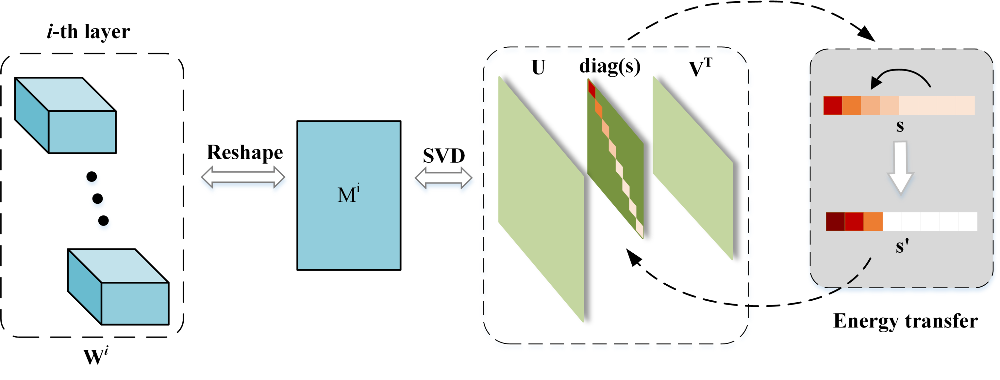

# Compact Model Training by Low-Rank Projection with Energy Transfer(TNNLS 2024)

[](https://arxiv.org/abs/2204.05566)
<a href="https://pytorch.org/get-started/locally/"></a>

This is the official PyTorch implementation of [Compact Model Training by Low-Rank Projection with Energy Transfer](https://arxiv.org/abs/2204.05566).

## Introduction
In this paper, we devise a new training method, low-rank projection with energy transfer (LRPET), that trains low-rank compressed networks from scratch and achieves competitive performance.   Comprehensive experiments on image classification, object detection and semantic segmentation have justified that our method is superior to other low-rank compression methods and also outperforms recent state-of-the-art pruning methods



## Usage
### CIFAR-10 dataset
Use python cifar10_train.py to train a new model. Here is some example settings:
```
CUDA_VISIBLE_DEVICES=0 nohup python cifar10_train.py  --model resnet56 --prun_goal 0.80 --redu_fac 0 --epochs 400 >SVD/CNN/cifar10/save_log/resnet56_prun0.80.log 2>&1 &
```

```
CUDA_VISIBLE_DEVICES=0 nohup python cifar10_train.py  --model resnet110 --prun_goal 0.62 --epochs 400 >cifar10/save_log/resnet110_prun0.62.log 2>&1 &
```

Use python search.py to search a model. Here is a example setting:
```
CUDA_VISIBLE_DEVICES=0 nohup python search.py  --model resnet56  --redu_fac 0 --epochs 60 >cifar10/save_log/resnet56_prun0.7_search.log 2>&1 &
```
### ImageNet dataset
```
CUDA_VISIBLE_DEVICES=0 nohup python imagenet_resnet_trans_train.py  -a resnet34 --prun_goal 0.58 > imagenet/save_log/imagenet_resnet34_prun0.58.log 2>&1 &
```
```
CUDA_VISIBLE_DEVICES=0 nohup python imagenet_resnet_trans_train.py  -a resnet50 --prun_goal 0.62 > imagenet/save_log/imagenet_resnet50_prun0.62.log 2>&1 &
```

### Others
We also apply LRPET in object detection, semantic segmentation and vision transformer models. The specific experimental code and results are also attached.
